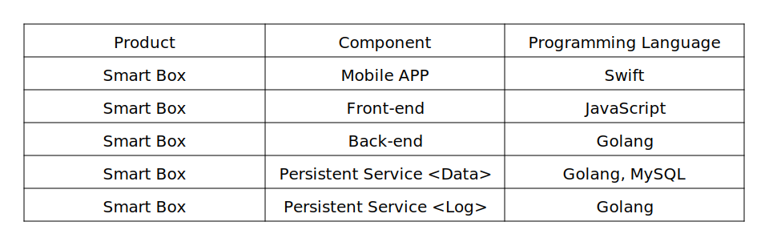

# table2svg

A command-line utility to render tabular data to an SVG table.

## Usage

Print the usage info:

```shell
./table2svg.py -h
```

## Examples

For the [example CSV data](examples/example.csv):

```csv
Product,Component,Programming Language
Smart Box,Mobile APP,Swift
Smart Box,Front-end,JavaScript
Smart Box,Back-end,Golang
Smart Box,Data Persistent Service,"Golang, MySQL"
```

The following command generates the default [SVG image](examples/1.svg):

```shell
./table2svg.py examples/example.csv
```



You can adjust the cell sizes, the font and the border style with the
command-line options like `--column_widths`, `--row_height`, `--font`,
`--borders`, `--header_row`, `--first_column`, etc.:

```shell
./table2svg.py examples/example.csv --header_row --first_column --column_widths 200 200 400 --row_height 30 --font Serif --font_size 14 --borders horizontal
```

Here is the generated [SVG image](examples/2.svg):


You can also customize the colors and the line width with the options like
`--background_color`, `--line_width`, `--line_color`, `--font_color`, etc.:

```shell
./table2svg.py examples/example.csv --background_color '#cef' --line_width 5 --line_color '#9cf' --font_color '#069' --font 'monospace' --font_size 16
```

Here is the generated [SVG image](examples/3.svg):


